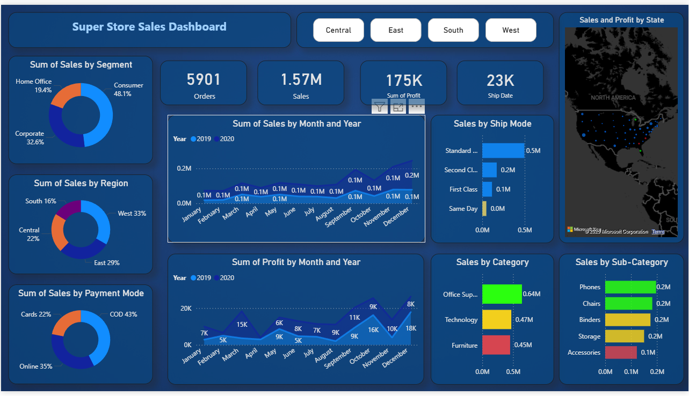

# 📊 SuperStore Sales Dashboard & Forecast

An interactive sales analysis and forecasting dashboard built using **Power BI**. This project explores sales, profit, and product performance data from a fictional SuperStore and includes predictive insights using Power BI's built-in analytics tools.

---

## 📝 Project Description

This dashboard provides business stakeholders with a comprehensive view of SuperStore’s sales performance across different regions, categories, and customer segments. The goal was to extract insights through **exploratory data analysis (EDA)** and build a **sales forecast model** using Power BI’s native forecasting capabilities.

---

## 🎯 Objective

- Analyze sales, profit, and order trends across key segments.
- Identify top-performing product categories and underperformers.
- Forecast future sales using historical data trends.
- Create an interactive and visually appealing dashboard for decision-makers.

---

## 📊 Key Insights

- 📈 **Sales Trends:** Seasonal peaks observed at year-end months.
- 🛒 **Top Categories:** Technology and Office Supplies drive the most sales.
- 📉 **Profit Loss:** Certain sub-categories (e.g., Tables) had negative profits despite high sales.
- 🌍 **Regional Performance:** The West region consistently outperformed others in profit.
- 🔮 **Forecasting:** Projected sales show an upward trend, particularly in the Technology segment.

---

## 🛠 Tools & Technologies Used

- **Power BI Desktop** – For dashboard development and visuals
- **Power Query** – For data transformation and cleaning
- **DAX (Data Analysis Expressions)** – For custom KPIs and calculations
- **Forecasting Tools** – Native Power BI line chart forecasting

---

## 📎 Dashboard Features

- 🔘 Region, Category, and Segment Slicers for filtering
- 📈 Line Chart with forecast and trendlines
- 📊 Stacked Bar and Column Charts to compare performance
- 📍 Map View for region-wise sales distribution
- 💡 KPI Cards showing Total Sales, Profit, and Orders

---

## 📁 Dataset

This project uses a fictional **SuperStore Sales dataset**, commonly used in BI and data science case studies.

---

## 📷 Sample Dashboard Preview

> *(Replace `dashboard-screenshot.png` with your actual image filename in the repo)*

---

